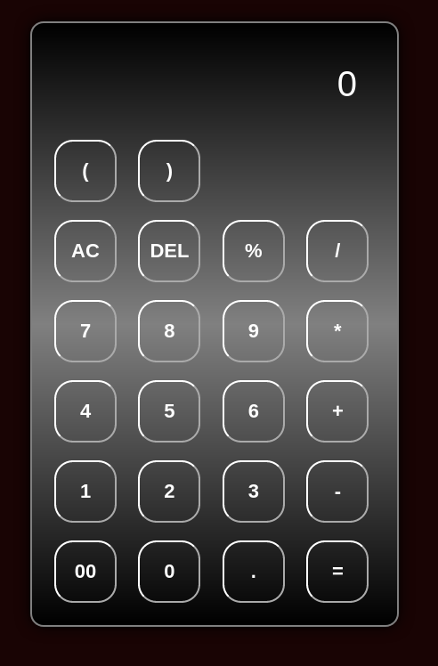

# Calculator

A simple calculator web application with basic arithmetic operations.



## Features

- Addition, subtraction, multiplication, and division
- Percentage calculation
- Parentheses support for complex expressions
- Keyboard support for enhanced usability

## Usage

1. Clone the repository:

   ```bash
   git clone https://github.com/your-username/calculator.git
